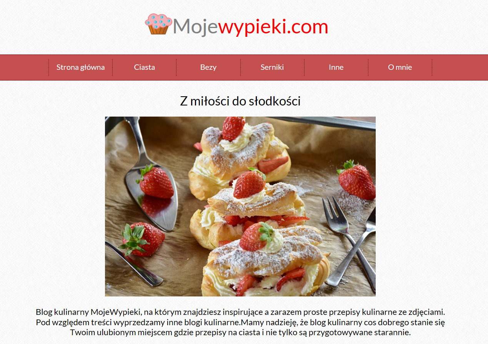

# Project Name
> MojeWypieki.com

## Table of contents
* [General info](#general-info)
* [Screenshots](#screenshots)
* [Technologies](#technologies)
* [Setup](#setup)
* [Features](#features)
* [Status](#status)
* [Inspiration](#inspiration)
* [Contact](#contact)

## General info
Internet homepage of culinary blog, menu with sticky function, fontello fonts and Subtle Patterns usage.

## Screenshots

## Technologies
* HTML5
* CSS3
* JavaScript
* JQuery

## Setup
You can open this project using a web browser.

## Code Examples

`	

		

		
			

				
				Mojewypieki.com
				

			

		

		

			<ol>
				<li><a href="#">Strona główna</a></li>
				<li><a href="#">Ciasta</a>
					<ul>
						<li><a href="#">Biszkopty</a></li>
						<li><a href="#">Babki</a></li>
						<li><a href="#">Ucierane</a></li>
						<li><a href="#">Kruche</a></li>
					</ul>
				</li>`

## Features
List of features ready and TODOs for future development
* use of subtle Patterns
* using JQuery and stickyNav
 * using fontello fonts

## Status
Project is: _finished

## Inspiration
Project inspired by Miroslaw Zelent's css course.

## Contact
Created by [@Webmasterka](https://github.com/webmasterka) - feel free to contact me!
